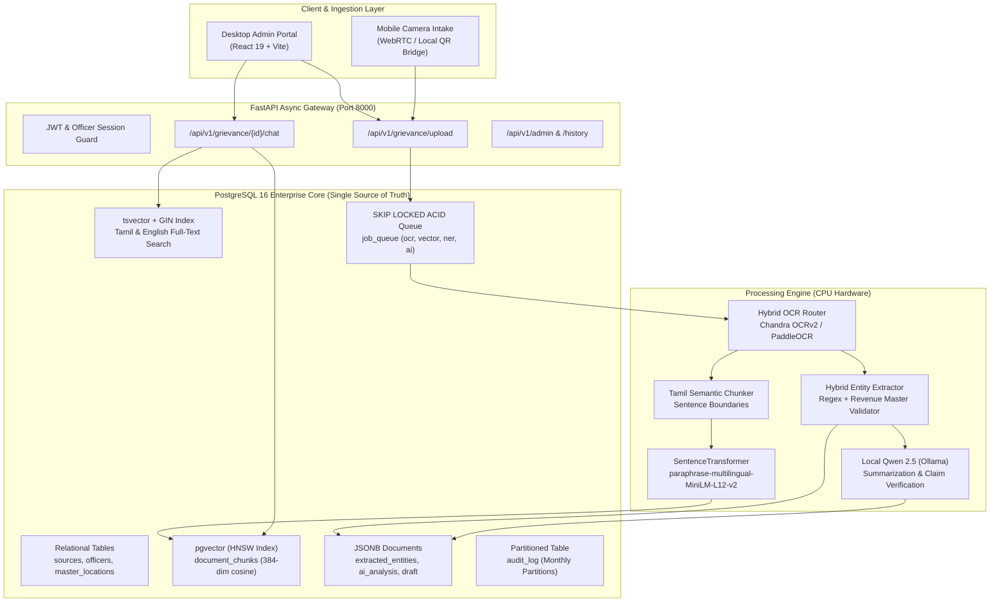

# 🏛️ GDP Assistant: AI-Powered Grievance Redressal & Digitization Platform

<div align="center">


[](LICENSE)
[](https://python.org)
[](https://fastapi.tiangolo.com)
[](https://react.dev)
[](https://github.com/pgvector/pgvector)
[](https://ollama.ai)
[](CONTRIBUTING.md)

</div>

<p align="center">
  <strong>An enterprise-grade, offline-capable civic intelligence system engineered for District Revenue Officers (DRO) to digitize, verify, classify, and route handwritten and printed Tamil grievance petitions in seconds on consumer hardware across any operating system.</strong>
</p>

---

## 📋 Table of Contents

- [Overview](#-overview)
- [System Architecture & The Postgres-First Law](#-system-architecture--the-postgres-first-law)
- [Key Features](#-key-features)
- [Processing Pipeline](#-processing-pipeline)
- [Tech Stack](#%EF%B8%8F-tech-stack)
- [Project Structure](#-project-structure)
- [Prerequisites & Models Setup](#-prerequisites--models-setup)
- [Cross-Platform Quickstart](#-cross-platform-quickstart)
  - [Option A: Docker Compose (Universal - Linux / macOS / Windows)](#option-a-docker-compose-universal)
  - [Option B: Native One-Click Launch (Windows)](#option-b-native-one-click-launch-windows)
  - [Option C: Native Launch (Linux & macOS)](#option-c-native-launch-linux--macos)
  - [Manual Step-by-Step Installation](#manual-step-by-step-installation)
- [API Reference & Endpoints](#-api-reference--endpoints)
- [Security, Anti-Hallucination & Governance](#-security-anti-hallucination--governance)
- [Contributing](#-contributing)
- [License](#-license)

---

## 💡 Overview

In district administration across Tamil Nadu, thousands of citizens submit handwritten and printed petitions during weekly **Grievance Day Petition (GDP)** collectorate sessions. Revenue officers previously faced manual data entry bottlenecks, lost tracking metadata, and delays in routing grievances to responsible taluk and firka officers.

**GDP Assistant** modernizes this civic workflow into an automated, fault-tolerant, and zero-cloud-dependency pipeline:
1. **Wireless Mobile Intake**: Officers or intake staff scan petitions directly via phone cameras using local Wi-Fi QR pairing.
2. **Deep Optical Recognition (Chandra OCRv2 + PaddleOCR)**: Datalab Chandra OCRv2 extracts complex handwritten Tamil typography; local PaddleOCR and OpenCV adaptive filters serve as an offline fallback.
3. **Deterministic Entity Extraction & PII Redaction**: Automatically extracts petitioner names, mobile numbers, door numbers, revenue taluks, and survey numbers while masking Aadhaar numbers (`XXXX-XXXX-1234`).
4. **Cognitive Analysis with Multi-Page Budgeting**: Analyzes multi-page petitions (applicant header, narrative body, and final prayer / signatory page) without dropping critical details.
5. **Dynamic CM Helpline Taxonomy Alignment**: Matches grievances dynamically against 40 official departments and 1,862 sub-types from `cm_helpline_taxonomy.json` with zero hardcoding.
6. **Direct DRO Portal Bridge**: Once verified by an officer, petitions are formatted and dispatched directly into the state grievance redressal system.

---

## 🏗️ System Architecture & The Postgres-First Law

GDP Assistant is architected under the **Postgres-First Law**: **Zero Redis, Zero RabbitMQ, Zero Kafka, Zero Pinecone, Zero Chroma, and Zero MongoDB**. A single, hardened PostgreSQL 16 instance satisfies the entire platform's persistence, vector indexing, full-text search, and task orchestration needs.



---

## ✨ Key Features

- **Split Workspace**: Dual-panel view with high-resolution petition viewer on the left and dynamic AI assistant chat, draft editor, and metadata on the right.
- **Cognitive Document Chat**: Ask questions in Tamil or English grounded strictly in petition text with instant answer verification.
- **Mobile QR Capture**: Intake staff scan a QR code on their smartphone to upload multi-page petitions directly into the officer's desktop workspace.
- **Editable Officer Profile**: Revenue officers can manage their identity, designation, department, and taluk jurisdictions directly from the top navigation bar.
- **Anti-Hallucination Barrier**: Automatically cross-references all extracted claims against raw OCR chunks and flags unverified information.
- **Formal Administrative Tamil**: Enforces 3rd-person administrative Tamil summaries (`மனுதாரர் [பெயர்] ... கோரியுள்ளார்`) adhering to official collectorate conventions.

---

## 🛠️ Tech Stack

| Layer | Technology | Purpose |
| :--- | :--- | :--- |
| **Frontend** | React 19, Vite 8, Lucide React | Modern, responsive officer interface |
| **Backend API** | FastAPI 0.111+, Pydantic v2, Python 3.11+ | Asynchronous REST gateway & queue orchestration |
| **Database** | PostgreSQL 16 + pgvector | Relational, vector, full-text, and queue storage |
| **Primary OCR** | Datalab Chandra OCRv2 API | State-of-the-art Tamil handwriting recognition |
| **Offline OCR** | PaddleOCR (PP-OCRv5) + OpenCV | Offline text detection and recognition fallback |
| **Embeddings** | `paraphrase-multilingual-MiniLM-L12-v2` | 384-dimensional multilingual dense vectors |
| **Cognitive LLM** | Qwen 2.5 (3B / 7B) via Ollama | Local offline summarization & classification |

---

## 📂 Project Structure

```
GDP_Assistant/
├── backend/
│   ├── alembic/                # Database migrations
│   ├── app/                    # FastAPI routers, dependencies, config
│   ├── core/                   # Security, LLM client
│   ├── data/
│   │   └── cm_helpline_taxonomy.json # 40 departments & 1,862 sub-types
│   ├── models/                 # SQLAlchemy 2.0 ORM & Pydantic schemas
│   ├── services/               # OCR, Chunker, NER, Vector Store, AI Analyzer
│   ├── tests/                  # Automated pytest test suites
│   ├── Dockerfile              # Backend container definition
│   └── requirements.txt        # Pinned Python dependencies
├── frontend/
│   ├── src/                    # React 19 UI components, styles, services
│   ├── Dockerfile              # Frontend container definition
│   └── package.json            # Node.js dependencies
├── docker-compose.yml          # Unified multi-container stack
├── run_all.bat                 # One-click Windows launch script
├── run_backend.bat             # Windows backend launcher
├── run_frontend.bat            # Windows frontend launcher
├── run_all.sh                  # Linux / macOS launch script
├── run_backend.sh              # Linux / macOS backend launcher
├── run_frontend.sh             # Linux / macOS frontend launcher
├── .env.example                # Unified configuration template
├── CONTRIBUTING.md             # Contribution guidelines
└── LICENSE                     # Apache License, Version 2.0
```

---

## 📦 Prerequisites & Models Setup

1. **Python 3.11+** and **Node.js 18+ LTS**.
2. **Ollama**:
   ```bash
   # Install Ollama from https://ollama.ai, then pull the recommended model:
   ollama pull qwen2.5:3b
   ```
3. **Docker** (optional, for containerized execution).

---

## 🚀 Cross-Platform Quickstart

### Option A: Docker Compose (Universal)

Works identically on **Linux**, **macOS**, and **Windows**:

```bash
# 1. Clone the repository
git clone https://github.com/MUKESH-WORK/smart-petition-ocr.git GDP_Assistant
cd GDP_Assistant

# 2. Configure environment
cp .env.example .env

# 3. Start the entire platform (Postgres + pgvector, Backend, Frontend)
docker compose up --build -d
```

- **Frontend Portal**: `http://localhost:5174`
- **FastAPI Backend**: `http://localhost:8000`
- **API Documentation**: `http://localhost:8000/api/v1/docs`

---

### Option B: Native One-Click Launch (Windows)

Double-click or run from PowerShell / Command Prompt:

```bat
run_all.bat
```

This starts both the FastAPI backend (`http://localhost:8000`) and the Vite frontend (`http://localhost:5174`).

---

### Option C: Native Launch (Linux & macOS)

Make scripts executable and launch:

```bash
chmod +x run_all.sh run_backend.sh run_frontend.sh
./run_all.sh
```

---

### Manual Step-by-Step Installation

#### 1. Database Setup
```bash
# Start PostgreSQL 16 + pgvector container
docker compose up -d postgres
```

#### 2. Backend Setup
```bash
cd backend
python -m venv .venv

# Activate virtual environment:
# Windows: .venv\Scripts\activate
# Linux / macOS: source .venv/bin/activate

pip install -r requirements.txt
alembic upgrade head
python init_db.py
uvicorn app.main:app --host 0.0.0.0 --port 8000 --reload
```

#### 3. Frontend Setup
```bash
cd frontend
npm install
npm run dev
```

---

## 📡 API Reference & Endpoints

| Method | Endpoint | Description |
| :--- | :--- | :--- |
| `POST` | `/api/v1/grievance/upload` | Uploads PDF/image petition; enqueues OCR and processing pipeline |
| `GET` | `/api/v1/grievance/{id}/status` | Checks real-time processing status of all pipeline stages |
| `GET` | `/api/v1/grievance/{id}/ocr` | Retrieves OCR extracted text, bounding boxes, and tables |
| `GET` | `/api/v1/grievance/{id}/analysis` | Retrieves AI summaries, suggested departments, and grounding scores |
| `GET` | `/api/v1/grievance/{id}/draft` | Retrieves pre-populated DRO portal draft record |
| `PUT` | `/api/v1/grievance/draft/{id}` | Updates draft fields following officer review |
| `POST` | `/api/v1/grievance/draft/{id}/approve` | Digitally signs and approves draft with officer credentials |
| `POST` | `/api/v1/grievance/draft/{id}/push-to-dro`| Dispatches approved grievance to external state DRO portal |
| `GET` | `/api/v1/admin/health` | Comprehensive health check across DB, Vector Store, and Queue |

---

## 🛡️ Security, Anti-Hallucination & Governance

1. **Aadhaar Masking**: All 12-digit UIDAI numbers are automatically redacted to `XXXX-XXXX-1234` prior to persistence.
2. **Claim Grounding Verification**: Every factual statement generated by AI is verified against raw OCR text chunks. If ungrounded or `hallucination_score > 0.20`, officer verification is required.
3. **Master DB Validation**: Locations are matched against official Tamil Nadu master records (`master_locations`).
4. **Mandatory Officer Approval**: Submissions to the state DRO system require explicit officer sign-off (`officer_approved == True`).
5. **Partitioned Audit Log**: Every system event is immutably recorded in monthly partitioned audit tables.

---

## 📄 License

Licensed under the **Apache License, Version 2.0**. See the [LICENSE](LICENSE) file for complete details.
